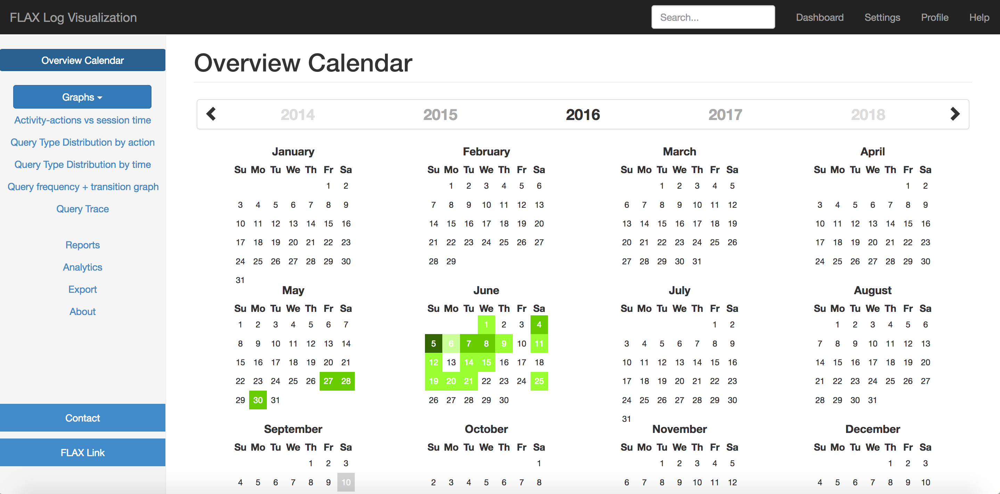

# FLAX System Log Visualization

This is an Open Source Project, 
which is a part of FLAX System (University of Waikato open source project).

Log file example: http://yihaoye.github.io/FLAX-log-visualization/usage-logs/example_usage.log.

The FLAX log visualization system presents several data analyses with corresponding graph.

Overview Calendar of all users' behaviors.

Relations among different users' behaviors.

User's behavior trace tree.

And you can find more graphs and functions in this link: http://yihaoye.github.io/FLAX-log-visualization/front-end/.

